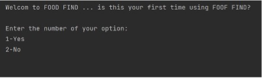
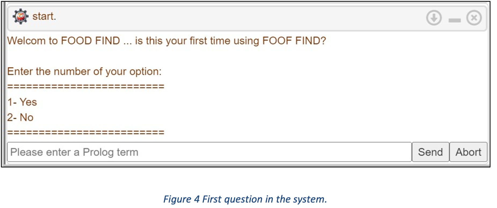

# Find-Food-System
Find food system is to provide the user with a healthy meal recommendation to avoid harmful of allergic ingredients contained in any product. 
Whether the ingredients may cause some negative symptoms to the user's health, such as allergies and others, by matching user input with recipe properties from our dataset.
The same idea was developed two separate systems in two different languages: Python and Prolog.

## Table of contents
- [Find Food system](#Find-Food-System)
  - [Table of contents](#table-of-contents)
  - [Screenshots](#screenshots)
  - [Technologies](#technologies)
  - [Setup](#setup)
  - [Features](#features)
  - [Status](#status)
  - [Inspiration](#inspiration)

## Screenshots
Python Language run:

Prolog Language run:



## Technologies
* Python
* Prolog

## Setup
When running the system using Prolog:
1. Run ```start``` command to run the system.
2. Answer the questions and get a proper meal.

## Features
Recommend proper meals for users.

## Status
Project is: _completed_.
## Inspiration
Project for Foundations of declarative programming in Python, and Prolog.
